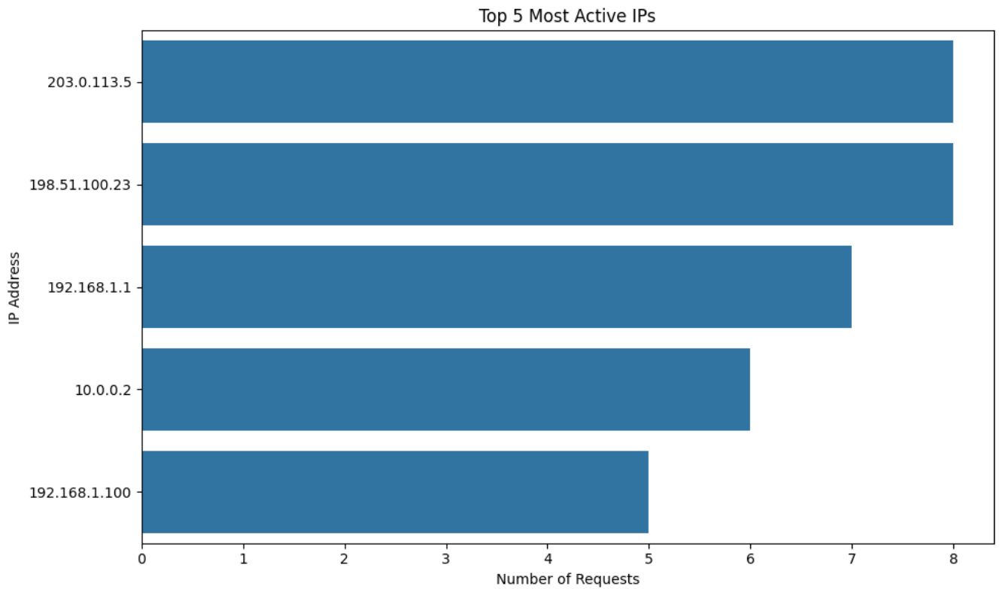
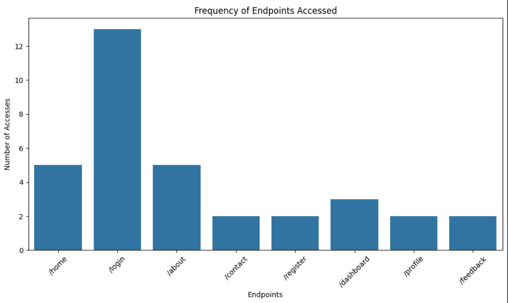
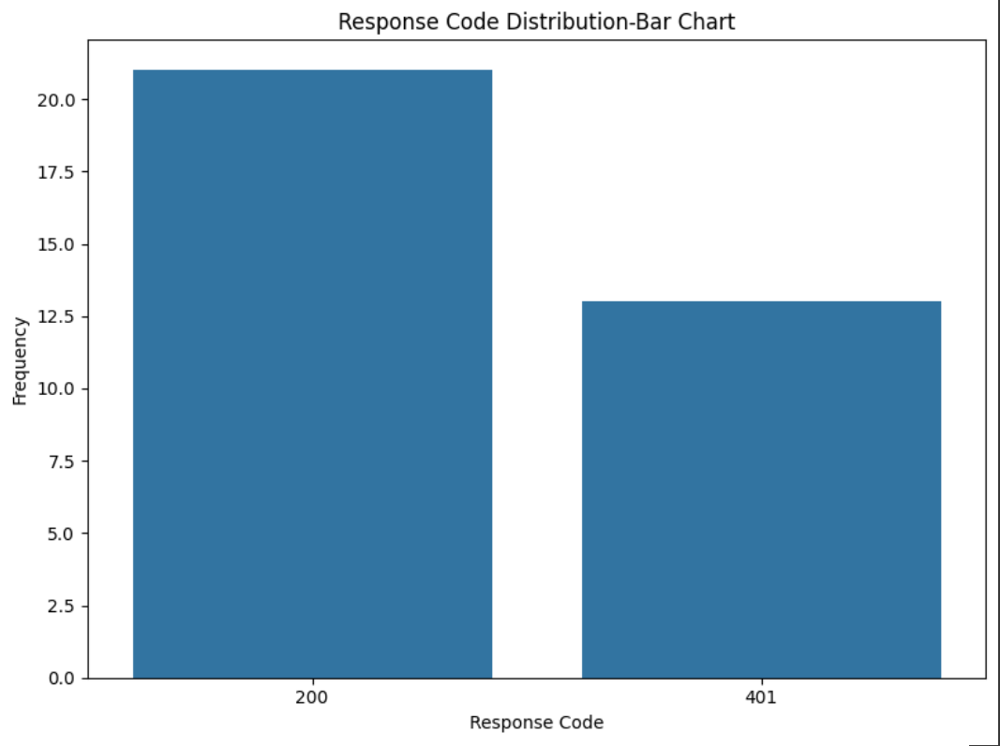
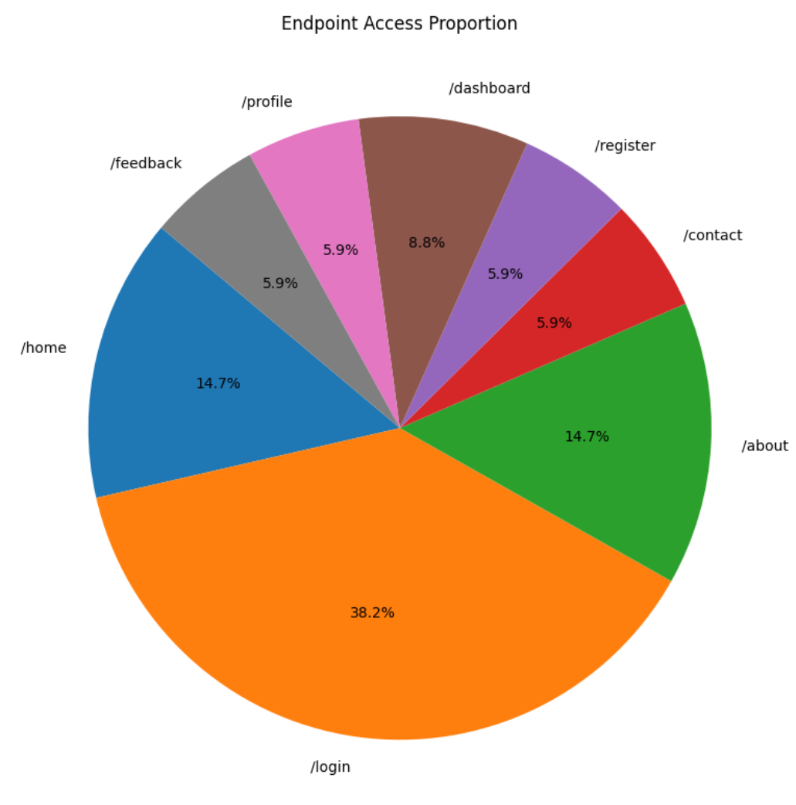
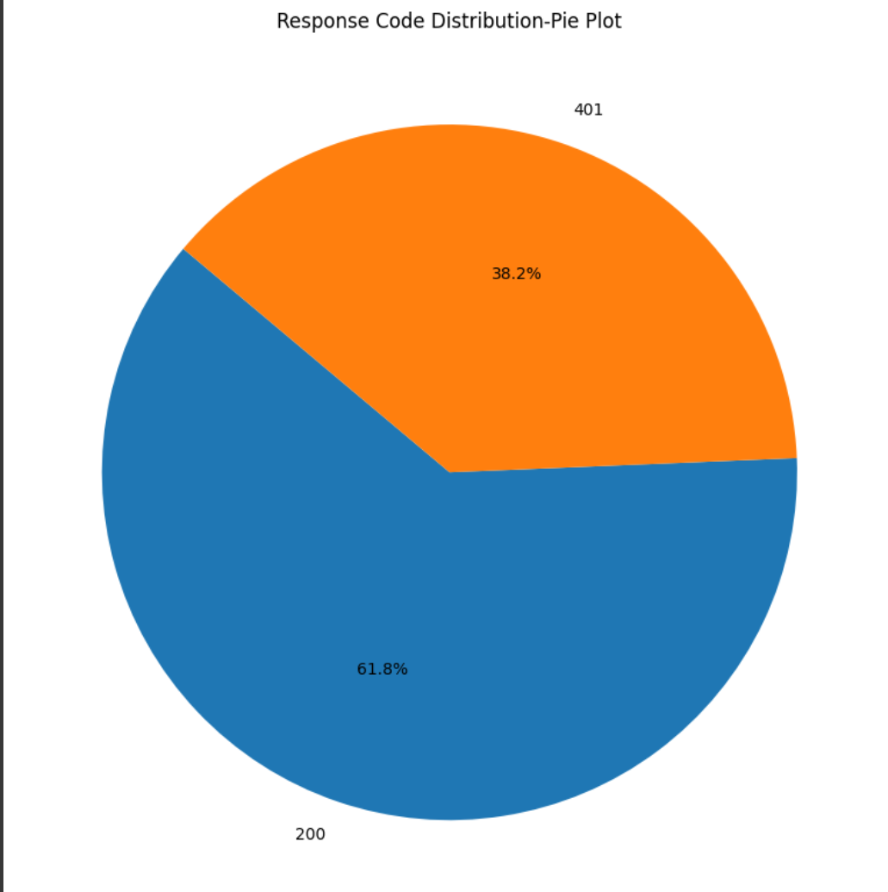
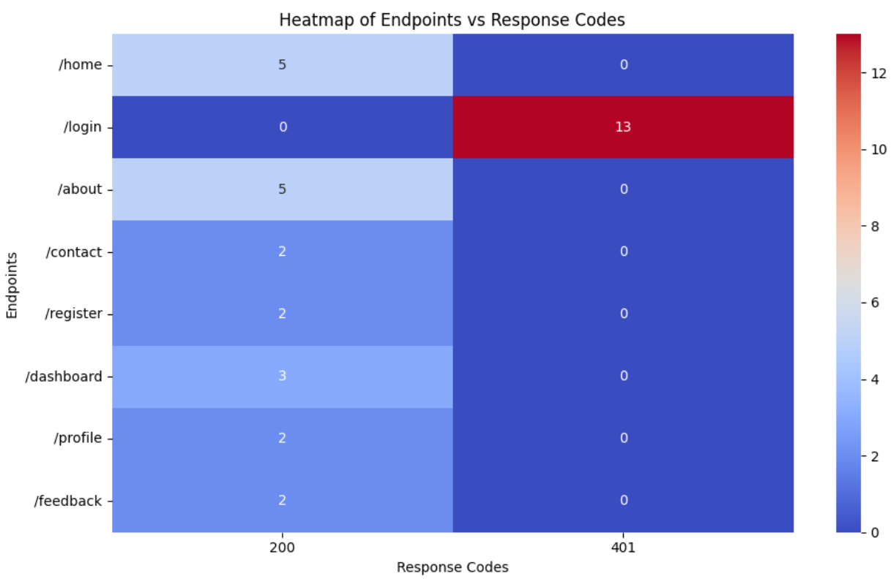

# Log File Analysis and Visualization

This project provides a Python-based solution for analyzing server log files. It parses the log data, extracts insights, visualizes key metrics, and saves the analysis results to a CSV file.

## Features

1. **Log Parsing**: 
   - Extracts data such as IP addresses, endpoints, and response codes from server logs.
   
2. **Analysis**:
   - Counts the number of requests per IP address.
   - Identifies the most accessed endpoints.
   - Detects suspicious activities (e.g., multiple failed login attempts).

3. **Visualization**:
   - Bar plots for:
     - Top 5 most active IPs.
     
     - Frequency of accessed endpoints.
     
     - Distribution of response codes.
     
   - Pie charts for:
     - Endpoint access proportions.
     
     - Response Code.
     
   - Heatmap for:
     - Response code vs Endpoint .
     

4. **Results Export**:
   - Saves the analyzed data to a CSV file `log_analysis_results.csv` with the following structure:
     - **Requests per IP**: `IP Address`, `Request Count`
     - **Most Accessed Endpoint**: `Endpoint`, `Access Count`
     - **Suspicious Activity**: `IP Address`, `Failed Login Count`

## Requirements

- Python 3.x
- Libraries:
  - `matplotlib`
  - `seaborn`
  - `csv`
  - `re`
  - `collections`

